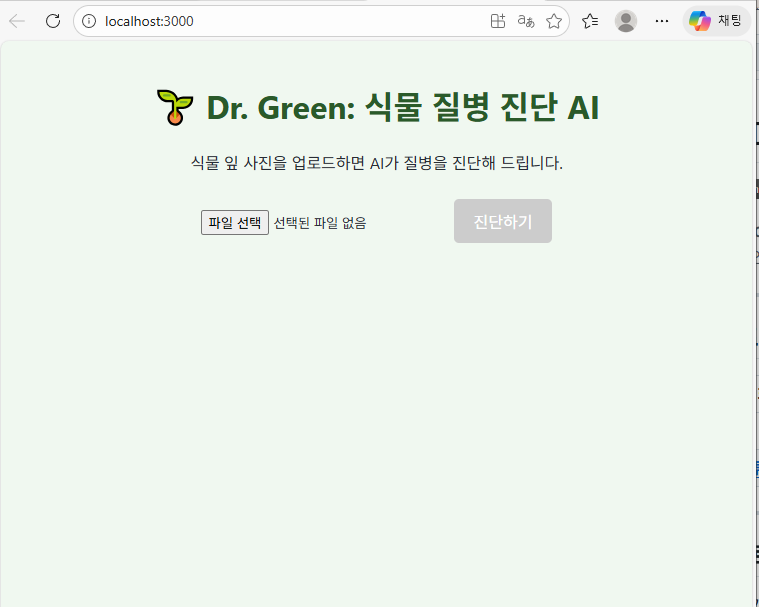

# 🌱 Dr. Green: AI 기반 식물 질병 진단 웹 서비스


> **"식물이 아픈가요? Dr. Green에게 물어보세요!"** > 딥러닝(ResNet50)을 활용하여 38종의 식물 질병을 진단하고, 맞춤형 대처 방안을 제공하는 웹 서비스입니다.

---

## 📸 프로젝트 시연 (Demo)

| 메인 화면 & 이미지 업로드 | AI 진단 결과 & 솔루션 |
| :---: | :---: |
|  |  |

**📺 [유튜브 시연 영상 보러가기](https://youtu.be/TTor1DFvPoY)**

---

## 💡 프로젝트 소개 (Overview)

최근 홈 가드닝(Home Gardening) 인구가 늘어나면서 비전문가도 쉽게 식물의 질병을 파악하고 대처할 필요성이 커졌습니다.  
**Dr. Green**은 스마트폰이나 PC로 잎 사진을 찍어 올리면, AI가 즉시 질병명을 판독하고 **"어떻게 치료해야 하는지"** 해결책까지 원스톱으로 제공하는 서비스입니다.

### ✨ 주요 기능
1.  **이미지 업로드**: 드래그 앤 드롭으로 간편하게 식물 잎 사진 입력
2.  **AI 질병 진단**: 38개의 질병 클래스 중 하나를 89% 정확도로 분류
3.  **솔루션 제공**: 진단된 병명에 맞는 원인, 증상, 치료법 데이터(JSON) 출력
4.  **반응형 웹**: PC 및 모바일 환경 지원

---

## 🛠 기술 스택 (Tech Stack)

### AI & Data
* **Model**: ResNet50 (Pre-trained on ImageNet -> Fine-tuned)
* **Framework**: PyTorch
* **Dataset**: New Plant Diseases Dataset (Kaggle)
* **Environment**: Google Colab (T4 GPU)

### Backend
* **Framework**: FastAPI
* **Server**: Uvicorn
* **Library**: Pillow (이미지 처리), Python-multipart

### Frontend
* **Library**: React.js
* **HTTP Client**: Axios
* **Styling**: CSS3

---

## 📂 프로젝트 구조 (Structure)

```bash
Dr-Green-Project
├── backend
│   ├── main.py          # FastAPI 서버 메인 (API 엔드포인트)
│   ├── plant_model.pth  # 학습된 PyTorch 모델 파일
│   ├── solutions.json   # 질병별 대처 방안 데이터베이스
│   └── requirements.txt # 백엔드 의존성 목록
├── frontend
│   ├── src
│   │   ├── App.js       # React 메인 로직 (UI 및 API 연동)
│   │   └── App.css      # 스타일 시트
│   └── package.json     # 프론트엔드 의존성 목록
└── README.md
